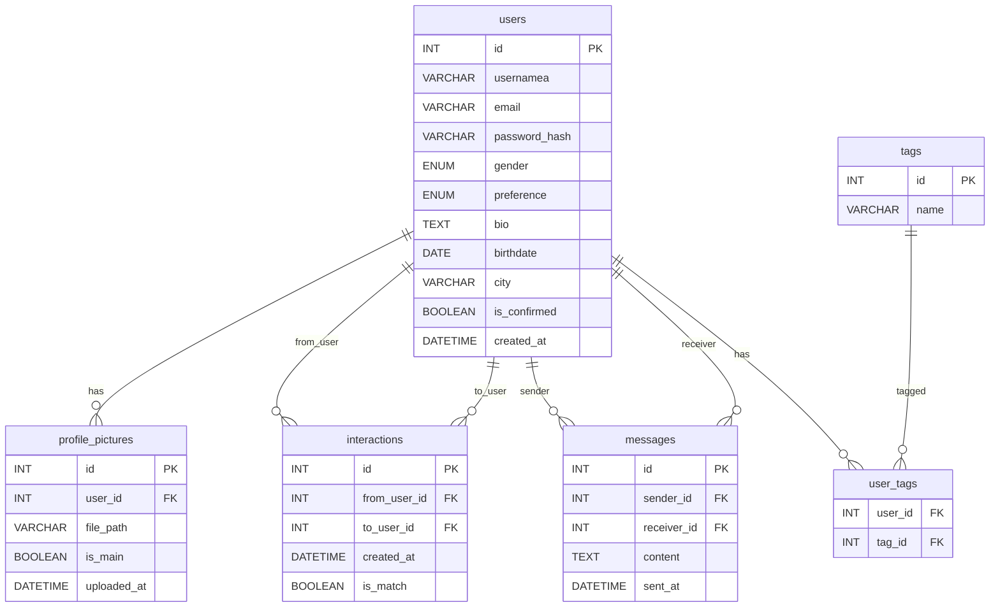

# Shéma de la bdd

Ce shéma est à lire avec un plugin [Mermaid](https://mermaid.live/).  
Plugin vscode adapté : [Markdown Preview Mermaid Support](https://marketplace.visualstudio.com/items?itemName=vstirbu.vscode-mermaid-preview).
